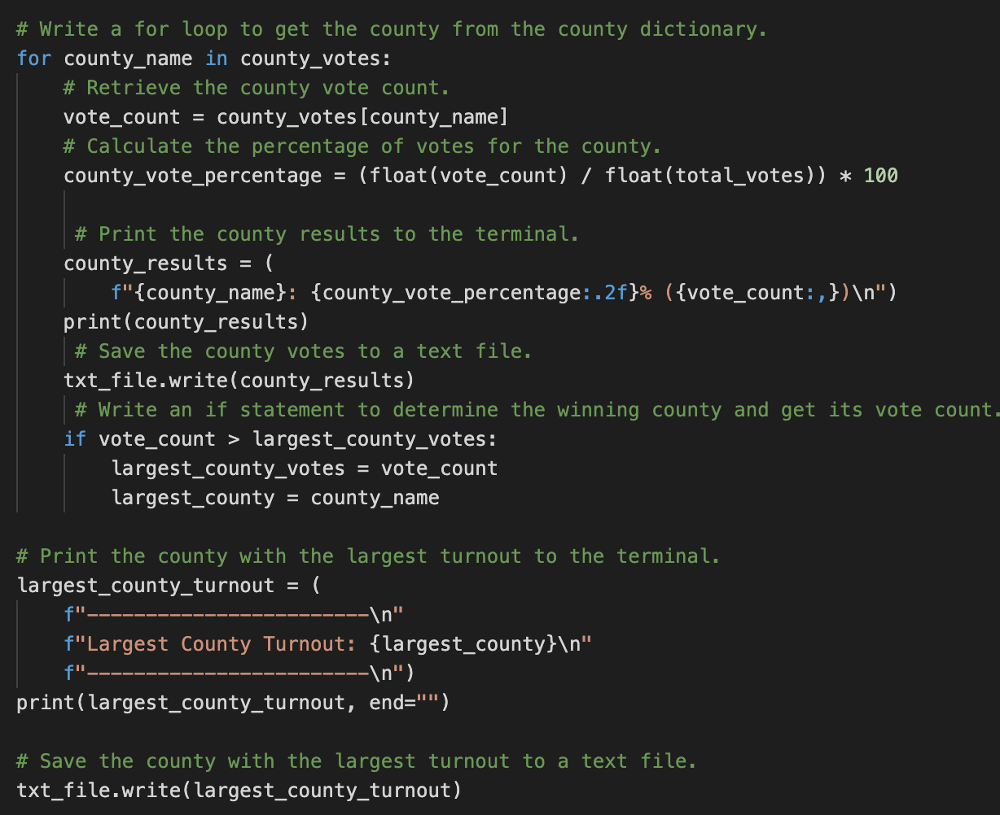
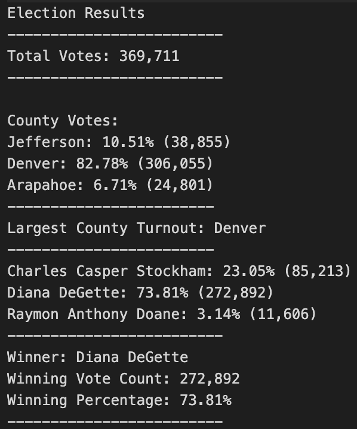

# Election_Analysis
## Project Overview
The objective of the election analysis project is to provide an audit of the results of a recent local congressional election in Colorado. At the end of the analysis, our python script will be able to give the following details:

1. Calculate the total number of votes cast.
2. Get a complete list of candidates who received votes.
3. Calculate the total number of votes each candidate received.
4. Calculate the percentage of votes each candidate won.
5. Determine the winner of the election based on popular vote.

## Resources
- Data Source: election_results.csv
- Software: Python 3.9.5, Visual Studio Code, 1.56.1

## Initial Summary
The initial analysis of the election shows that:
- There were 369,711 votes cast in the election.
#### The candidates were:
- Charles Casper Stockham
- Diana DeGette
- Raymon Anthony Doane
#### The candidate results were:
- Charles Casper Stockham received 23.0% of the vote and 85,213 votes.
- Diana DeGette received 73.8% of the vote and 272,892 votes.
- Raymon Anthony Doane received 3.1% of the vote and 11,606 votes.
#### The winner of the election was:
- Diana DeGette, who received 73.8% of the vote and 272,892 votes.

## Overview of Election Audit
### This section provides insight into the the purpose of this election audit analysis.
The purpose of this analysis is to audit the tabulated results for a US congressional precinct in Colorado. This analysis will provide data on the following:
  - The voter turnout for each county
  - The percentage of votes from each county out of the total count
  - The county with the highest turnout
Working from the data source: election_results.csv file, this analysis utilized for loops and conditional statements with membership and logical operators to find the requested results. Then, printed the results to the command line and saved them to an election_results.txt file.

#### County Results Code

### Election-Audit Results
  - There were 369,711 votes cast in this congressional election. This number agrees with the initial election summary.

#### Election Analysis Results

##### Candidate Results
  - Charles Casper Stockham received 23.0% of the vote and 85,213 votes.
  - Diana DeGette received 73.8% of the vote and 272,892 votes.
  - Raymon Anthony Doane received 3.1% of the vote and 11,606 votes.
  - Diana DeGette, who received 73.8% of the vote and 272,892 votes, won the election

##### County Results
  - The county with the largest turnout was Denver.
  - Jefferson county received 10.5% of the votes and 38,855 total votes.
  - Denver county received 82.8% of the votes and 306,055 total votes.
  - Arapahoe county received 6.7% of the votes and 24,801 total votes.
  - Denver county had the largest voter turnout.

## Election-Audit Summary
### The Ask
The election commission explores how this script can be used for any election, with two examples for modifying the script.
If we decomposed the ask by making the following assumptions:
1. Users of the script may or may not have knowledge of python and they would require an easy way to specify their csv file without needing to change the file name or file path in the code.
2. We may or may not assume that every csv file will have three columns with County name and Candidate name as the second and third columns respectively.

### The Solution
##### Define Data Source
We may propose a solution that provides the user with he ability to input the name of their csv file and the parent folder of the file. We would then use an indirect path method to locate and read the file on the users machine. This way our script is flexible enough to take any csv file without making any changes to the code.

##### Column Names and Column Position
With the assumption that column names and position will not always be same for all csv files across all preccincts, we may modify our code to allow the user input the column name that contains county name and candidate name. Our script will then attempt to match user input with the column names in the csv file.
